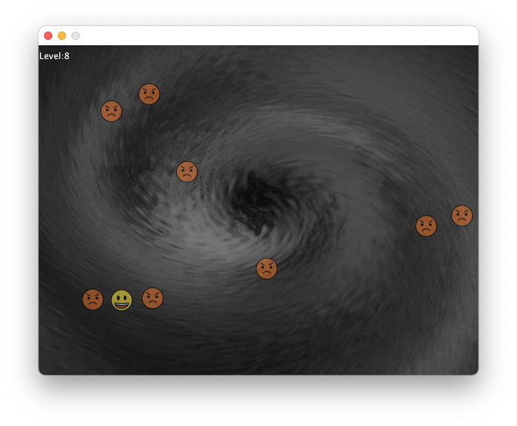

# gan-men-avoid



Avoid flying faces.

## Build

```
javac cloud/inucat/GanMenAvoid/*.java
```

## Play

```
java cloud.inucat.GanMenAvoid.Entrypoint
```

## Control

- `UP`, `DOWN`, `LEFT`, `RIGHT` : Move
- `R` : Revive
- `SPACE` : Exit

## LICENSE

Source code is written by inucat, licensed under MIT license.

## CREDIT

- Face pictures: OpenMoji – the open-source emoji and icon project. License: CC BY-SA 4.0
- Background image: ぴぽや https://pipoya.net/
- Music: BE. https://commons.nicovideo.jp/users/129789961
- Sound effect: TAM Music Factory https://www.tam-music.com/
